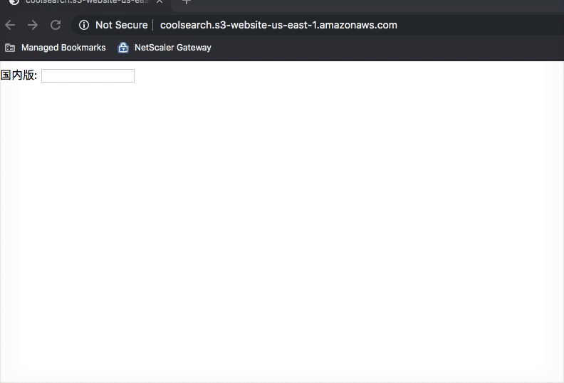
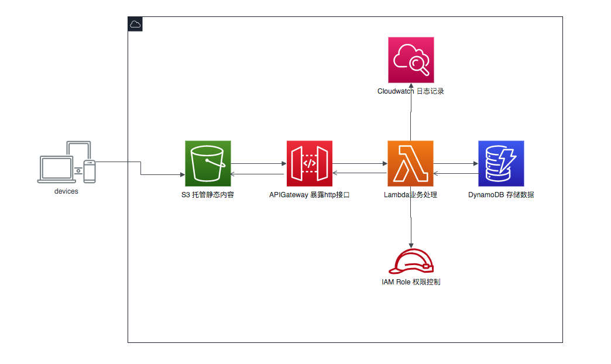
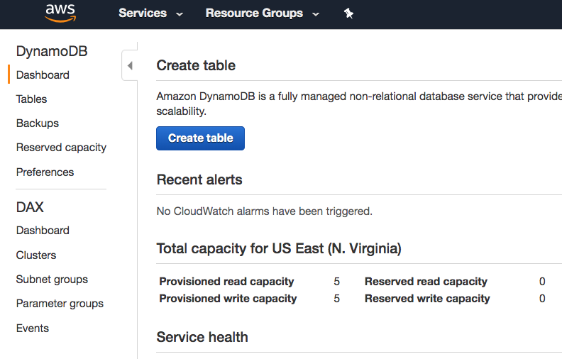
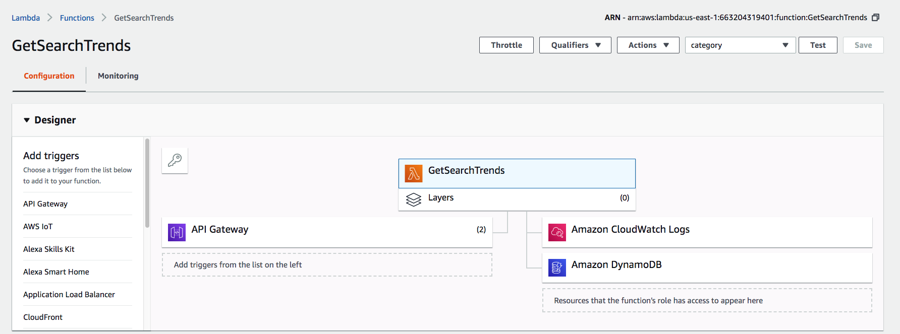
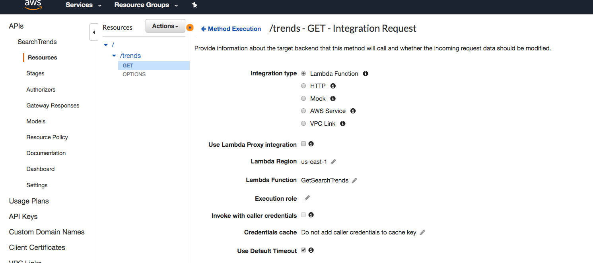
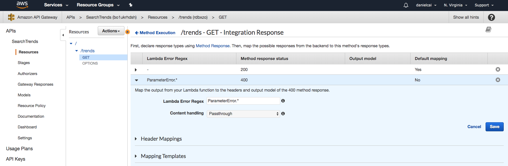
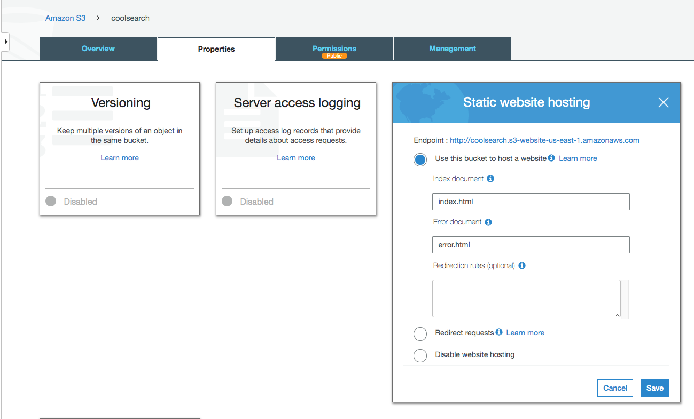
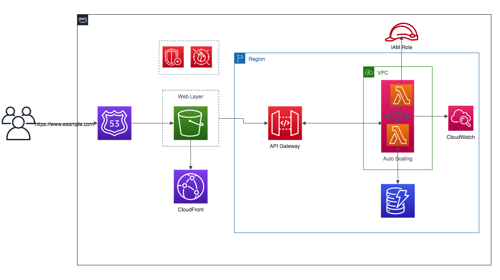

# 功能说明
本demo主要实现用户访问搜索网站时，当用户输入搜索条件，系统根据搜索关键字，自动列出跟搜索条件相关联的一些用户常用搜索选项，进而提高用户体验。

## Demo演示及地址


[Demo地址](http://coolsearch.s3-website-us-east-1.amazonaws.com/ "Demo")

# 使用到的AWS服务
本demo使用到了如下一些AWS服务：
1. Lambda
2. S3
3. DynamoDB
4. APIGateway
5. IAM Role
6. Cloudwatch

# Demo系统架构及说明
## 系统架构图

上图是本demo的系统架构图，并不适用于生产环境，更完善的系统架构，请参考文末的系统架构图

## 系统说明
1.本系统基于AWS无服务架构，利用AWS的Lambda服务进行业务处理，Lambda具有很灵活的扩展性，当系统的请求增加，负载压力加剧时，Lambda服务将会自动扩展更多的实例来应对系统增加的请求，这一过程无需人工干预。收费方面，AWS根据系统的吞吐量和执行时间进行收费，用户无需支付实例维护相关费用。详细文档请参阅[Lambda文档](https://aws.amazon.com/lambda/ "Lambda文档")。

2.Web层，本系统利用AWS的S3服务托管静态内容(HTML相关文件)，S3托管的静态内容会暴露一个自动生成的URL供客户访问。在真实的生产环境中，我们可以使用AWS的Route53提供的域名服务给用户提供一个更加友好的访问网址。

3.Lambda提供的业务通过AWS的APIGateway暴露给系统的Web层。利用APIGateway，我们可以很方便地将业务功能通过http协议暴露出去。

4.本系统的数据库层采用AWS的DynamoDB，DynamoDB是一个文档型数据库。类似于Lambda，用户无需维护它的实例。DynamoDB的吞吐量可以根据系统的需要进行配置。

5.系统的日志由Cloudwatch进行记录。

6.服务跟服务之间的访问权限通过IAM Role进行配置和控制。

# 项目实施步骤
## 1.开通AWS账号
访问[亚马逊注册中心](https://portal.aws.amazon.com/billing/signup?redirect_url=https%3A%2F%2Faws.amazon.com%2Fregistration-confirmation&language=zh_cn#/start "亚马逊注册中心")开通账号，包含12个月的免费套餐，可以用来学习。

注意：开通账号需要信用卡信息，当资源使用完毕注意关闭资源，以免产生不必要的费用！

## 2.创建DynamoDB表
通过刚刚创建的账号，登录到AWS的portal。选择DynamoDB服务，点击创建表的按钮进行表的创建



本Demo我们创建的表包含一个Primary partition key:category,文档示例如下
```
 {
  "category": "鞋子",
  "trends": [
    "鞋子理论是什么",
    "鞋子尺码",
    "鞋子品牌",
    "鞋子码数",
    "鞋子除臭",
    "鞋子尺码对照表"
  ]
}
```

## 3.创建IAM Role
进入AWS的portal，选择IAM Role,创建新的IAM Role,该Role允许访问DynamoDB以及创建相应的LogGroup，JSON配置内容如下
```
{
    "Version": "2012-10-17",
    "Statement": [
        {
            "Sid": "VisualEditor0",
            "Effect": "Allow",
            "Action": [
                "dynamodb:BatchGetItem",
                "logs:CreateLogStream",
                "dynamodb:BatchWriteItem",
                "dynamodb:PutItem",
                "dynamodb:GetItem",
                "dynamodb:Scan",
                "dynamodb:Query",
                "dynamodb:UpdateItem",
                "logs:PutLogEvents"
            ],
            "Resource": [
                "arn:aws:logs:us-east-1:663204319401:*",
                "arn:aws:dynamodb:us-east-1:663204319401:table/SearchTrends"
            ]
        },
        {
            "Sid": "VisualEditor1",
            "Effect": "Allow",
            "Action": "logs:CreateLogGroup",
            "Resource": "*"
        }
    ]
}
```

## 4.创建Lambda函数
进入AWS的portal，选择Lambda,我们创建一个基于Nodejs10的Lambda函数,该函数根据用户传过来的搜索条件，搜索DynamoDB数据库中的记录，并返回给APIGateway。Execution role选择第三部创建的角色。



[Lambda函数代码](https://github.com/ruhaitsia/aws_demos/blob/master/serverlessDemo/src/index.js "Lambda函数代码")


## 5.配置APIGateway
配置APIGateway调用Lambda函数，并通过http协议将接口暴露出去。



配置APIGateway调用Lambda函数的错误处理，当Lambda函数返回错误，APIGateway返回相应的错误代码给调用方



## 6.配置S3托管静态内容
创建S3 bucket并将静态内容传到bucket中，通过配置将web内容通过url开放给用户访问



Bucket规则如下：
```
{
    "Version": "2012-10-17",
    "Statement": [
        {
            "Sid": "PublicReadGetObject",
            "Effect": "Allow",
            "Principal": "*",
            "Action": "s3:GetObject",
            "Resource": "arn:aws:s3:::coolsearch/*"
        }
    ]
}
```

[HTML代码](https://github.com/ruhaitsia/aws_demos/blob/master/serverlessDemo/src/index.html "HTML代码")

# Production架构图
